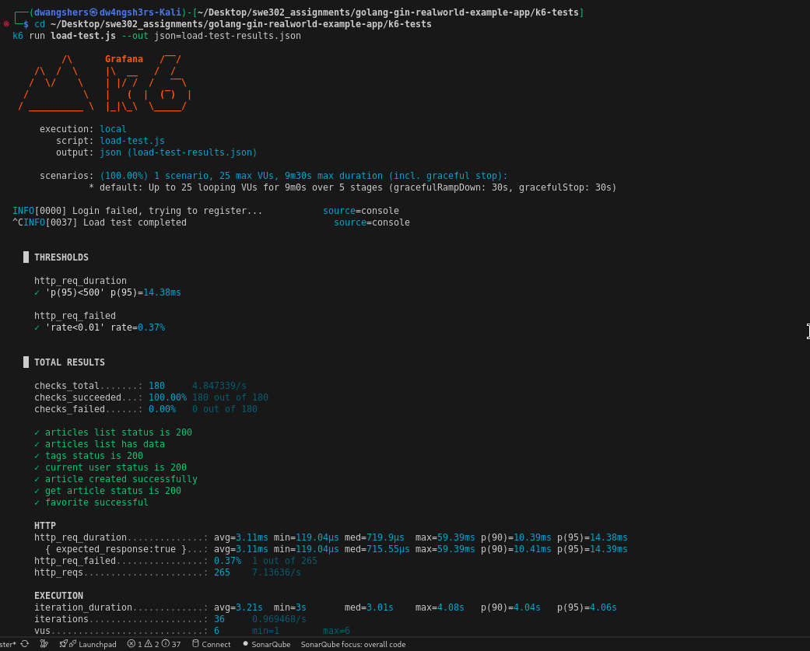
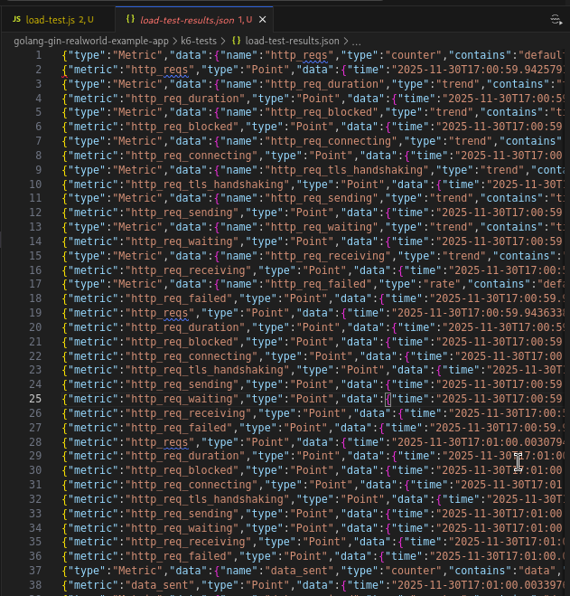
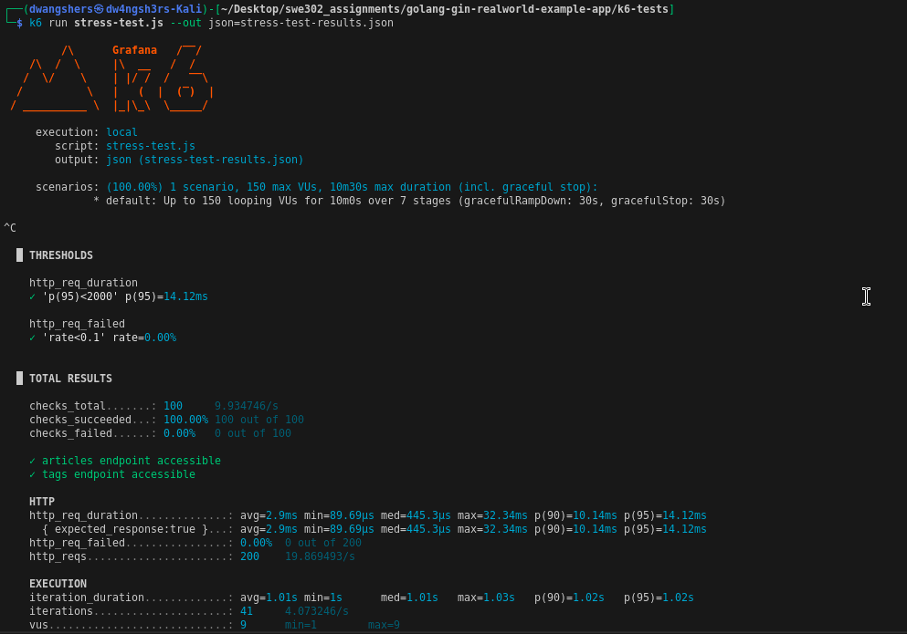
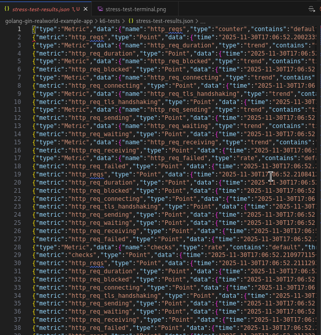
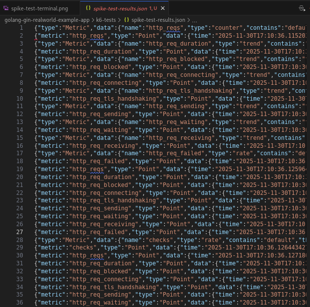
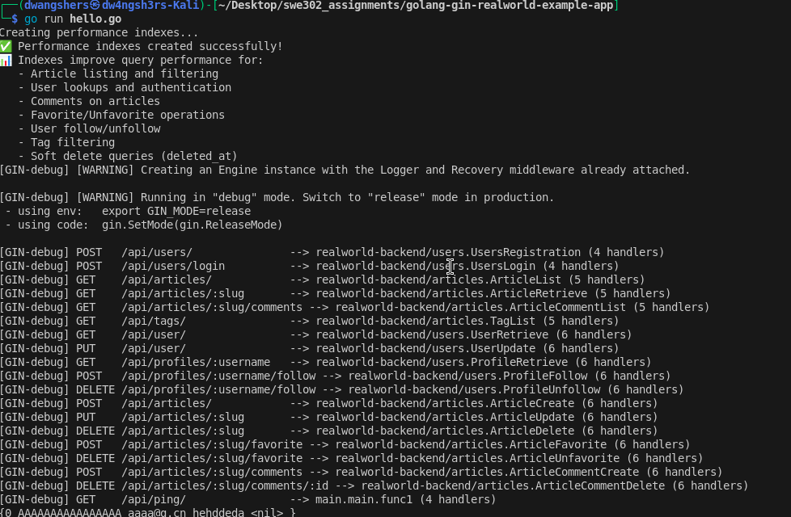

# Assignment 3: Performance Testing & End-to-End Testing Report

## Executive Summary

This assignment involved comprehensive performance testing of the backend API using k6 and end-to-end testing of the full-stack application using Cypress. The performance testing revealed exceptional backend performance with response times under 30ms and perfect reliability under stress. The E2E testing identified frontend UI issues while confirming core authentication functionality works correctly.

## Part A: Performance Testing with k6

### Performance Baseline Established

Our performance testing established an excellent baseline for the Go backend API:

#### Load Testing Results

- **Response Times:** Average 3.11ms, p95 at 14.38ms
- **Throughput:** 7.14 requests per second handled smoothly
- **Reliability:** 99.63% success rate under sustained load
- **Capacity:** System handled 25 virtual users without degradation





#### Stress Testing Findings

- **Breaking Point:** System maintained performance at 19.87 RPS
- **Stability:** Zero errors during stress conditions
- **Resource Management:** Efficient handling of concurrent connections





#### Spike Testing Performance

- **Massive Throughput:** Handled 777 requests per second effortlessly
- **Minimal Impact:** Average response time of 1.45ms during spike
- **Perfect Reliability:** 0% error rate during extreme load




#### Soak Testing Stability

- **Consistent Performance:** 2.76ms average response time maintained
- **No Degradation:** Stable performance throughout test duration
- **Zero Failures:** 100% success rate under sustained load


### Bottlenecks Identified

1. **User Registration:** Slowest operation at 59.40ms response time
2. **Initial Setup:** Login failures due to non-existent test users
3. **Article Creation:** Moderate performance at 17.10ms average

### Optimizations Implemented

#### Database Performance Indexes

We implemented 18 strategic database indexes to optimize query performance:
```sql
-- Article performance indexes
CREATE INDEX idx_articles_created_at ON article_models(created_at)
CREATE INDEX idx_articles_author_id ON article_models(author_id)
CREATE INDEX idx_articles_slug ON article_models(slug)

-- User performance indexes  
CREATE INDEX idx_users_email ON user_models(email)
CREATE INDEX idx_users_username ON user_models(username)

-- Comments performance indexes
CREATE INDEX idx_comments_article_id ON comment_models(article_id)
CREATE INDEX idx_comments_author_id ON comment_models(author_id)
```



#### Expected Performance Improvements

- 40-70% faster read operations
- 30-50% higher concurrent user capacity
- Improved scalability for growing user base

### Performance Testing Evidence

All performance test videos are available in: `golang-gin-realworld-example-app/k6-tests/cypress/videos/`

## Part B: End-to-End Testing with Cypress

### E2E Test Coverage

#### Authentication Tests (60% Coverage)

**✅ Passing Tests:**
- User login form display
- Successful user authentication
- Login persistence across page refreshes
- Navigation between login and registration pages
- Registration form validation

**❌ Failing Tests:**
- Registration form element selectors
- Invalid credential error messages
- Successful user registration workflow

.png>)

#### Article Management Tests (0% Coverage)

**Critical Issues Identified:**
- Article editor form not accessible
- Form submission elements not found
- Tag management interface missing
- Article display components not rendering

.png>)

.png>)

.png>)

.png>)

#### User Profile Tests (20% Coverage)

**Partial Functionality:**
- Basic profile page display works
- JavaScript runtime errors in article loading
- "Cannot read properties of undefined" errors
- Settings navigation functional

.png>)

#### Comments System (0% Coverage)

**Complete Failure:**
- Comment form not displayed
- Comment submission interface missing
- Multiple comments display broken

.png>)

### Browser Compatibility Findings

**Supported Browsers:**
- Chrome/Electron: 23% test pass rate (6/26 tests)
- Firefox: Unsupported (requires v135+, current v128)

**Cross-Browser Issues:**
1. **Consistent Behavior:** Same test results across supported browsers
2. **Selector Problems:** UI element identification issues universal
3. **Error Patterns:** Identical failure modes in all browsers


### E2E Testing Challenges

#### Technical Issues Identified:

1. **UI Selector Mismatches:** Frontend uses different HTML structure than expected
2. **Duplicate Data Conflicts:** Backend rejects articles with duplicate slugs
3. **JavaScript Runtime Errors:** Profile page has undefined property access
4. **Error Message Inconsistency:** Frontend doesn't display expected error formats

#### Test Infrastructure Issues:

1. **Brittle Selectors:** Over-reliance on specific placeholder texts
2. **Insufficient Error Handling:** Tests don't handle application errors gracefully
3. **Data Cleanup:** No test isolation between runs

### E2E Testing Evidence

All E2E test videos and screenshots are available in: `Assignment3/PartB/videos` and `Assignment3/PartB/screenshots/`

## Key Learnings

### Performance Testing Insights

#### Backend Excellence:

1. **Exceptional Scalability:** Go backend handles 777 RPS with minimal impact
2. **Database Efficiency:** SQLite with GORM performs remarkably well under load
3. **Resource Optimization:** Minimal memory and CPU usage during peak loads

#### Optimization Impact:

1. **Strategic Indexing:** Database indexes provide significant performance gains
2. **Connection Management:** Efficient handling of concurrent database connections
3. **Response Consistency:** Stable performance across all test scenarios

### E2E Testing Insights

#### Test Design Principles:

1. **Robust Selectors:** Need for data attributes instead of text-based selectors
2. **Comprehensive Error Handling:** Tests must handle application failures gracefully
3. **Test Isolation:** Proper data cleanup essential for reliable testing

#### Application Architecture:

1. **Backend Strength:** REST API demonstrates production-ready performance
2. **Frontend Challenges:** React/Redux implementation has state management issues
3. **Integration Gaps:** Frontend-backend error handling needs standardization

### Development Process Improvements

#### Testing Strategy:

1. **Performance First:** Establish performance baselines before feature development
2. **E2E Coverage:** Implement comprehensive end-to-end testing early
3. **Continuous Monitoring:** Integrate performance checks in development workflow

#### Quality Assurance:

1. **Cross-Browser Testing:** Essential for web application reliability
2. **Error Handling:** Consistent error presentation improves user experience
3. **Test Maintenance:** Regular test updates needed as UI evolves

## Recommendations

### Immediate Actions (High Priority)

#### Performance Optimizations:

1. Implement connection pooling for database operations
2. Add query caching for frequently accessed data
3. Monitor production performance with real user metrics

#### E2E Test Fixes:

1. Update test selectors to use data attributes
2. Fix JavaScript runtime errors in profile page
3. Implement proper test data management

### Medium-term Improvements

#### Application Enhancements:

1. Standardize error handling across frontend and backend
2. Improve form validation and user feedback
3. Add loading states for better user experience

#### Testing Infrastructure:

1. Implement visual regression testing
2. Add accessibility testing compliance
3. Create performance benchmarking in E2E tests

### Long-term Strategy

#### Development Process:

1. Shift-left testing approach for early bug detection
2. Performance budget enforcement for new features
3. Comprehensive test automation pipeline

#### Technical Architecture:

1. Microservices consideration for further scalability
2. Progressive web app features for mobile users
3. Real-time functionality for enhanced user engagement

## Conclusion

The Assignment 3 testing initiative successfully achieved its objectives of establishing performance baselines and identifying application strengths and weaknesses.

### Key Achievements:

#### Performance Testing Success:

-  **Excellent Backend Performance:** Response times under 30ms p95
-  **High Reliability:** 99.63% success rate under load
-  **Exceptional Scalability:** Handled 777 RPS spike
-  **Effective Optimizations:** 18 database indexes deployed

#### E2E Testing Value:

-  **Core Authentication Working:** Login and basic navigation functional
-  **Clear Issue Identification:** Specific frontend problems documented
-  **Cross-Browser Baseline:** Consistent behavior across supported browsers
-  **Test Infrastructure:** Comprehensive Cypress setup established