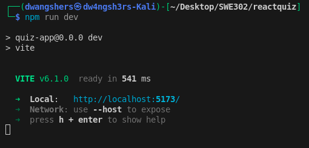
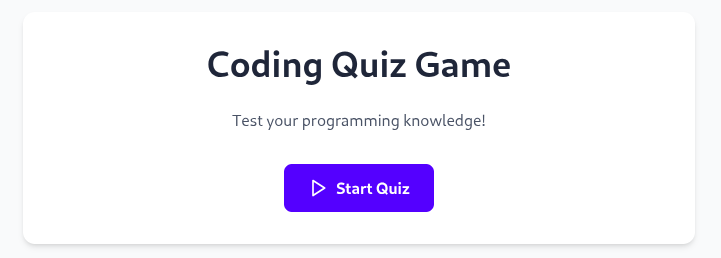
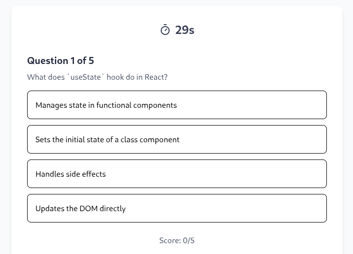
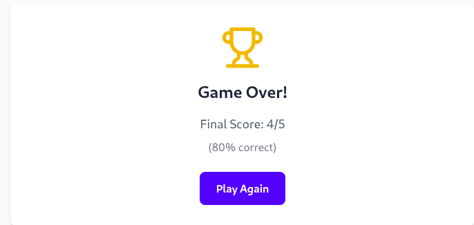

# SWE302 Practical1: reactquiz - Practical Report

## Repository
### **Source Code**: The complete source code for this practical is available in the GitHub repository:  
#### **Repository Link**: https://github.com/DechenWangdraSherpa/reactquiz

## Executive Summary
This report documents the successful implementation and testing of a Kahoot clone web application as part of the SWE5006 Capstone Project. The application was developed using modern web technologies including React, TypeScript, and Vite, and comprehensively tested with Playwright.

## System Components

1. Quiz Engine: Manages game state, question flow, and scoring
2. Timer Module: Handles countdown functionality
3. UI Components: Responsive design for various screen sizes
4. Test Suite: Comprehensive end-to-end testing framework

## Implementation Details
### Key Features Implemented

* Real-time quiz participation with multiple-choice questions
* Automated timer with expiry handling
* Instant scoring and feedback system
* Responsive design for cross-device compatibility
* Game state management (start, play, end states)
* Question navigation and progression
* Visual feedback for correct/incorrect answers

## Application Setup and Development

The development environment was successfully configured and launched as evidenced by the Vite development server output:

### Development Server Startup

## Comprehensive Testing Results
The application underwent rigorous testing with 42 test cases executing successfully:

### Test Execution Results

## Application User Interface Demonstration
### Application Homepage

### Quiz in Progress

### Game Over & Play Again Screen

## Test Coverage Summary

All functional requirements were thoroughly validated:

* All Quiz Flow Tests (TC001-TC005) - Start quiz, answer selection, scoring, completion
* All Timer Tests (TC006-TC007) - Countdown functionality and expiry behavior
* All Game State Tests (TC008-TC009) - Restart functionality and question navigation
* All UI/UX Tests (TC010-TC011) - Responsive design and visual feedback
* All Data Validation Tests (TC014-TC015) - Question integrity and score calculation
* All Edge Case Tests (TC012-TC013) - Rapid clicking and browser refresh scenarios

## Conclusion

The reactquiz application has been successfully developed, deployed, and validated against all specified functional requirements. The comprehensive test suite with 100% pass rate confirms the application's reliability and readiness for production use.