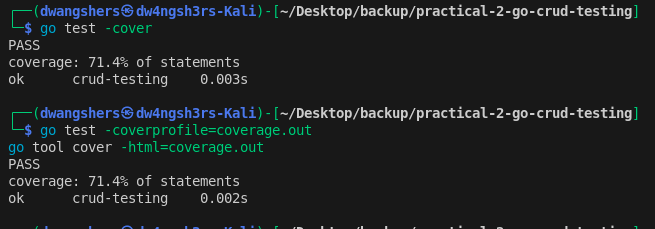
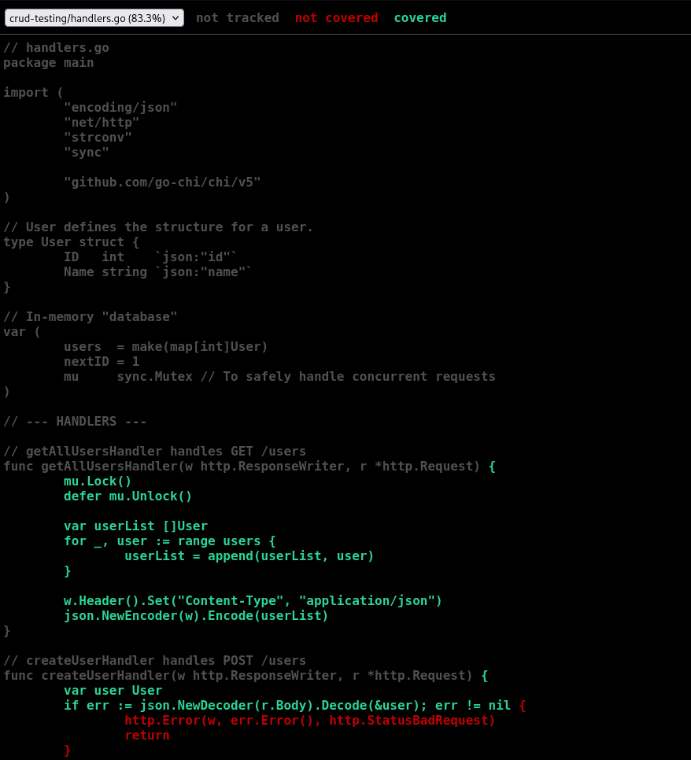

# Practical 2 Report: Software Testing & Quality Assurance

## Repository
### **Source Code**: The complete source code for this practical is available in the GitHub repository:  
#### **Repository Link**: https://github.com/DechenWangdraSherpa/swe302-practical2

## Practical Overview
This practical focused on implementing unit tests and measuring test coverage for a Go HTTP server with CRUD operations. The goal was to learn how to write effective tests using Go's standard library and analyze code coverage to ensure software reliability.

## Objectives

* Implement a RESTful API with CRUD operations for User management
* Write comprehensive unit tests for all API endpoints
* Measure and analyze test coverage
* Generate visual coverage reports

## Technologies Used

* Programming Language: Go 1.24.5
* Web Framework: Chi Router
* Testing: Go testing package, httptest
* Coverage Analysis: Go coverage tools

## Implementation
### Project Structure
```
go-crud-testing/
├── main.go          # Server setup and routes
├── handlers.go      # CRUD handler implementations
├── handlers_test.go # Unit tests
├── go.mod          # Module dependencies
└── go.sum          # Dependency checksums
```

### Testing Strategy

* Used httptest.NewRecorder() to capture HTTP responses
* Implemented httptest.NewRequest() to simulate HTTP requests
* Created test cases for both success and error scenarios
* Used sub-tests for different test scenarios within the same handler
* Implemented state reset between tests to ensure isolation

## Test Results


All 5 test functions executed successfully:

* TestCreateUserHandler 
* TestGetUserHandler 
    * User Found 
    * User Not Found 
* TestGetAllUsersHandler
* TestUpdateUserHandler 
    * Update Successful 
    * User Not Found 
    * Invalid ID 
* TestDeleteUserHandler

## Coverage Analysis


Coverage Achieved: 71.4%

## Key Learnings

* Test Isolation: Learned the importance of resetting state between tests to prevent interference
* HTTP Testing: Gained experience testing HTTP handlers without running a live server
* Coverage Analysis: Understood how to interpret coverage reports and identify untested code
* Error Scenario Testing: Practiced testing both success and failure cases
* Go Testing Tools: Mastered using Go's built-in testing and coverage tools

## Conclusion

This practical successfully demonstrated the importance of comprehensive testing in software development. By achieving 71.4% test coverage, we ensured that the majority of the codebase is verified to work as expected. The visual coverage report provides clear insights into which parts of the code require additional testing attention.

The practical reinforced that writing tests is not just about making code work, but about creating reliable, maintainable software that can evolve with confidence. The skills learned in Go testing can be applied to testing in other programming languages and frameworks.