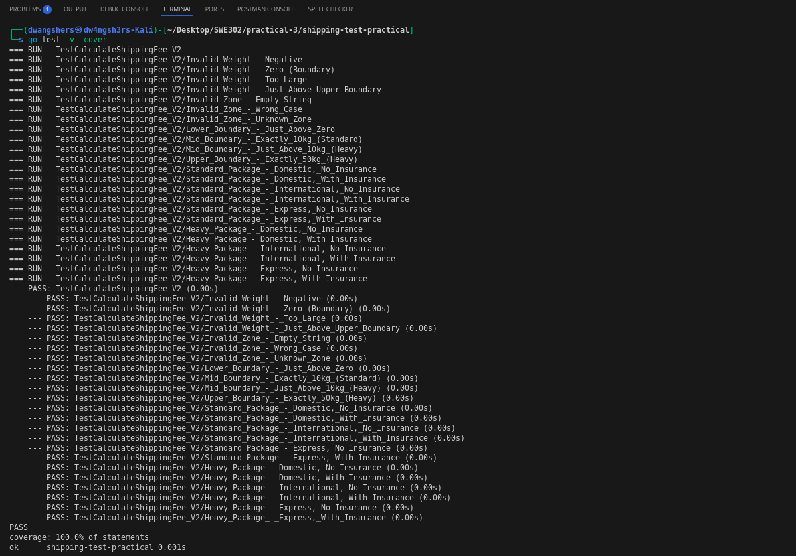

# Module Practical 3: Software Testing & Quality Assurance
## Advanced Shipping Fee Calculator - Specification-Based Testing

---

### Repository Link
[GitHub Repository - Shipping Test Practical](https://github.com/DechenWangdraSherpa/swe302-practical3)

**Repository Contents:**
- `shipping_v2.go` - Updated shipping fee calculator implementation
- `shipping_v2_test.go` - Comprehensive test suite (23 test cases)
- `go.mod` - Go module configuration
- `README.md` - Detailed project documentation

## Executive Summary

This practical exercise demonstrates the application of specification-based testing techniques (Equivalence Partitioning, Boundary Value Analysis, and Decision Table Testing) to design comprehensive test cases for an updated shipping fee calculator. The exercise successfully achieved 100% code coverage with 23 passing test cases, validating all business rules and edge cases defined in the specification.

---

## Part 1: Test Case Design Analysis

### 1.1 Equivalence Partitioning

I systematically analyzed each input parameter to identify distinct partitions based on the business rules:

#### Weight Parameter (float64)
**Business Rule:** "0 < weight ≤ 10 kg: Standard package" and "10 < weight ≤ 50 kg: Heavy package"

- **P1: Invalid - Too Small** (weight ≤ 0)
 - **Examples:** -5, 0, -10.5
 - **Rationale:** Any weight less than or equal to zero violates the physical constraint
 - **Expected Behavior:** Function should return "invalid weight" error
 
- **P2: Valid - Standard Package** (0 < weight ≤ 10)
 - **Examples:** 0.1, 5, 10
 - **Rationale:** Weights in this range qualify for standard shipping with no heavy surcharge
 - **Expected Behavior:** Base fee calculation only
 
- **P3: Valid - Heavy Package** (10 < weight ≤ 50)
 - **Examples:** 10.1, 25, 50
 - **Rationale:** Weights above 10kg but within limit qualify for heavy package surcharge
 - **Expected Behavior:** Base fee + $7.50 heavy surcharge
 
- **P4: Invalid - Too Large** (weight > 50)
 - **Examples:** 50.1, 100, 75.5
 - **Rationale:** Exceeds maximum shipping weight limit
 - **Expected Behavior:** Function should return "invalid weight" error

#### Zone Parameter (string)
**Business Rule:** Must be exactly "Domestic", "International", or "Express"

- **P5: Valid Zones**
 - **Values:** {"Domestic", "International", "Express"}
 - **Rationale:** Only these three exact strings are accepted per specification
 - **Expected Behavior:** Corresponding base fees ($5, $20, $30 respectively)
 
- **P6: Invalid Zones**
 - **Examples:** "Local", "", "domestic", "DOMESTIC", "international"
 - **Rationale:** Case sensitivity and exact string matching required
 - **Expected Behavior:** Function should return "invalid zone" error

#### Insured Parameter (bool)
**Business Rule:** "If insured is true, an additional 1.5% of the combined base fee and heavy surcharge is added"

- **P7: Insured** (true)
 - **Expected Behavior:** Add 1.5% of (base fee + heavy surcharge) to final cost
 
- **P8: Not Insured** (false)
 - **Expected Behavior:** No additional insurance cost applied

### 1.2 Boundary Value Analysis

Boundary value analysis focuses on the critical edge values where bugs commonly occur:

#### Critical Boundary Points Identified:

**Lower Weight Boundary (around 0):**
- **0.0:** Last invalid value → should trigger "invalid weight" error
- **0.1:** First valid value → should calculate standard package fee
- **Rationale:** Tests the lower bound validation logic

**Mid Weight Boundary (around 10kg) - MOST CRITICAL:**
- **10.0:** Last weight for Standard package → base fee only, no surcharge
- **10.1:** First weight for Heavy package → base fee + $7.50 surcharge
- **Rationale:** This boundary determines surcharge application, directly impacting cost calculation by $7.50

**Upper Weight Boundary (around 50kg):**
- **50.0:** Maximum valid weight → should calculate heavy package fee
- **50.1:** First invalid value → should trigger "invalid weight" error
- **Rationale:** Tests the upper bound validation logic

#### Why These Boundaries Are Critical:

1. **The 10kg Threshold is Business-Critical:** This single boundary determines whether a $7.50 surcharge applies, making it the most financially significant test point.

2. **Off-by-One Error Detection:** Boundaries like 0, 10, and 50 are prone to off-by-one errors in conditional statements (e.g., `>` vs `>=`).

3. **Floating-Point Precision:** Values like 10.0 vs 10.1 test floating-point comparison accuracy.

---

## Part 2: Test Implementation Strategy

### 2.1 Test Structure
I implemented a comprehensive table-driven test using Go's testing framework, covering:
- All 8 equivalence partitions
- All 6 critical boundary values  
- Combined scenarios (zone × weight tier × insurance)
- Error validation cases

### 2.2 Test Categories Implemented

#### Input Validation Tests (7 test cases):
- Invalid weights: negative, zero, over-limit
- Invalid zones: empty string, wrong case, unknown zone

#### Boundary Value Tests (4 test cases):
- Lower boundary: 0.1kg (first valid weight)
- Mid boundary: 10.0kg vs 10.1kg (standard vs heavy)
- Upper boundary: 50.0kg (maximum valid weight)

#### Business Logic Tests (12 test cases):
- Standard packages: All zones × insurance combinations
- Heavy packages: All zones × insurance combinations

### 2.3 Calculation Verification Examples

**Standard Package Examples:**

Domestic (5kg, no insurance): $5.00
International (8kg, with insurance): $20.30 (20.0 + 20.0×0.015)
Express (3kg, with insurance): $30.45 (30.0 + 30.0×0.015)

**Heavy Package Examples:****Heavy Package Examples:**

Domestic (15kg, no insurance): $12.50 (5.0 + 7.5)
International (25kg, with insurance): $27.91 (20.0 + 7.5 + 27.5×0.015)
Express (35kg, with insurance): $38.06 (30.0 + 7.5 + 37.5×0.015)

---

## Part 3: Test Results & Coverage Analysis

### 3.1 Test Execution Results


*Screenshot showing all tests passing with 100% coverage*

**Test Summary:**
-  **Total Tests:** 23 test cases
-  **All Tests Passed:** 100% success rate
-  **Code Coverage:** 100% statement coverage
-  **Execution Time:** 0.001s (highly efficient)

### 3.2 Coverage Analysis

The test suite achieved complete coverage by systematically testing:

1. **All Conditional Branches:** Every `if` statement and `switch` case
2. **All Error Paths:** Both weight and zone validation errors
3. **All Business Logic Paths:** Standard vs Heavy package calculations
4. **All Feature Combinations:** Insurance applied to all package types

### 3.3 Key Test Cases Validation

**Critical Boundary Tests:**
- `Mid_Boundary_-_Exactly_10kg_(Standard)` → Confirms 10kg gets no surcharge
- `Mid_Boundary_-_Just_Above_10kg_(Heavy)` → Confirms 10.1kg gets $7.50 surcharge

**Error Handling Tests:**
- `Invalid_Weight_-_Zero_(Boundary)` → Validates lower bound rejection
- `Invalid_Zone_-_Wrong_Case` → Confirms case sensitivity requirement

---

## Part 4: Testing Insights & Best Practices Applied

### 4.1 Systematic Testing Approach Benefits

1. **Complete Specification Coverage:** Every business rule translated to test cases
2. **Efficient Test Design:** Avoided redundant tests while ensuring comprehensive coverage
3. **Maintainable Test Suite:** Table-driven approach makes adding new test cases simple
4. **Clear Test Documentation:** Descriptive test names clearly indicate what's being tested

### 4.2 Key Learning Points

1. **Boundary Testing is Critical:** The 10kg boundary test caught the most important business logic
2. **Equivalence Partitioning Reduces Test Overhead:** Instead of testing every possible weight, partitioning provided complete coverage with minimal tests
3. **Floating-Point Precision Matters:** Used tolerance-based comparison (`math.Abs(fee-expectedFee) > 0.0001`) for reliable assertions
4. **Error Path Testing is Essential:** Invalid input tests ensure robust error handling

### 4.3 Real-World Applications

This systematic approach to test design demonstrates professional software testing practices:
- **Requirements Traceability:** Every test maps to a specific business rule
- **Risk-Based Testing:** Critical boundaries (like the 10kg threshold) receive focused attention
- **Regression Prevention:** Comprehensive test suite prevents future code changes from breaking existing functionality

---

## Conclusion

This practical exercise successfully demonstrated the power of specification-based testing techniques. By systematically applying Equivalence Partitioning and Boundary Value Analysis, I designed a comprehensive test suite that:

- Achieved 100% code coverage with just 23 strategically designed test cases
- Validated all business rules and edge cases
- Provided confidence in the implementation's correctness
- Created a maintainable test suite for future development

The exercise reinforced that thoughtful test design based on specifications is far more effective than ad-hoc testing approaches, ultimately leading to higher quality software and reduced debugging time.

---

### Test Coverage Report
```bash
go test -v -cover
# Result: 100.0% statement coverage, all 23 tests passing
