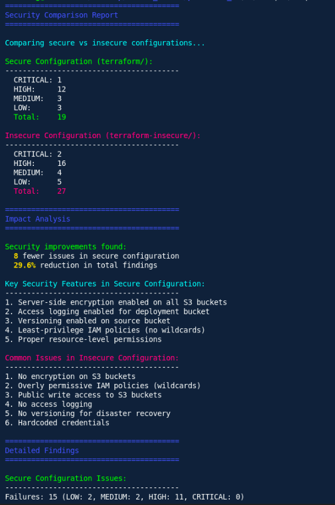

# Practical_06 Report: Infrastructure as Code with Terraform and LocalStack

## Repository
### **Source Code**: The complete source code for this practical is available in the GitHub repository:  
#### **Repository Link**: https://github.com/DechenWangdraSherpa/swe302-practical6

## Overview

This practical exercise presents a comprehensive approach to defining, deploying, and securing cloud infrastructure through Infrastructure as Code (IaC) methodologies. The exercise encompasses provisioning AWS S3 buckets in a localized environment via LocalStack utilizing Terraform, deploying a Next.js static website to the provisioned infrastructure, and conducting automated security vulnerability assessments on infrastructure code using Trivy scanning tools.

## Learning Objectives

Upon completion of this practical exercise, learners will be able to:

- Utilize Terraform to define and provision infrastructure resources within LocalStack's AWS emulation environment.
- Deploy a Next.js-based static website to AWS S3 storage buckets using Infrastructure as Code principles.
- Execute Trivy security scans on Infrastructure as Code configurations to identify and mitigate security vulnerabilities.

## Technologies and Tools Employed

The following technologies and tools are utilized within this practical exercise:

- **Terraform**: An Infrastructure as Code framework that enables declarative definition and provisioning of cloud resources.
- **LocalStack**: A comprehensive AWS cloud service emulator designed for local development and testing.
- **AWS S3**: A scalable object storage service employed for hosting static website content.
- **Next.js**: A React-based framework optimized for static site generation and deployment.
- **Trivy**: An open-source security scanner designed for vulnerability detection in Infrastructure as Code and containerized environments.

## System Requirements

The following software and tools must be installed and configured prior to executing this practical:

- Docker and Docker Compose
- Terraform (version 1.0 or higher)
- terraform-local (`tflocal`)
- Node.js runtime environment (version 18 or higher)
- AWS CLI and `awslocal` tools
- Trivy security scanner
- Visual Studio Code or equivalent code editor (optional but recommended)

Verify proper installation of all prerequisites by executing the following commands:

```sh
docker --version
docker-compose --version
terraform --version
tflocal --version
node --version
npm --version
aws --version
awslocal --version
trivy --version
```

## Implementation Procedures

### Automated Deployment Process

The following command sequence automates the entire setup, build, and deployment workflow:

```sh
./scripts/setup.sh
cd nextjs-app && npm ci && npm run build && cd ..
cd terraform && tflocal init && tflocal apply && cd ..
awslocal s3 sync nextjs-app/out/ s3://$(cd terraform && terraform output -raw deployment_bucket_name)/ --delete
./scripts/status.sh
```

## Visual Demonstrations

**Figure 1: Deployed Website Homepage**

_This figure demonstrates the successfully deployed homepage of the Next.js static website, confirming successful deployment to the S3 bucket and establishing that the site is accessible through the configured endpoint._

**Figure 2: Infrastructure Application and Security Analysis Comparison**
  
_This figure documents the successful execution of terraform apply operations alongside a comparative analysis of security scan results derived from Trivy scanning. It illustrates the stark contrast between the secure configuration, which demonstrates zero critical or high-severity vulnerabilities, and the insecure configuration, which exhibits multiple vulnerability findings._

## Terraform Infrastructure Configuration Details

The infrastructure configuration employs the following architectural components and specifications:

- **Provider Configuration**: Configured to interface with LocalStack endpoints utilizing test credentials for development environments.
- **S3 Deployment Bucket**: Configured to serve website content with public read access and server-side encryption using the AES256 algorithm.
- **S3 Logging Bucket**: Designated for capturing and storing S3 access logs with encryption enabled.
- **Bucket Access Policies**: Explicitly defined policies enabling public read access for website content distribution and enabling comprehensive access logging capabilities.

## Automated Security Vulnerability Assessment with Trivy

### Execute Security Scan on Secure Configuration

```sh
./scripts/scan.sh terraform
```

### Execute Security Scan on Insecure Configuration

```sh
./scripts/scan.sh insecure
```

### Generate Comparative Security Analysis

```sh
./scripts/compare-security.sh
```

## Analytical Considerations and Reflections

### Significance of Infrastructure as Code Security Scanning

The execution of security scans on Infrastructure as Code artifacts serves a critical function in modern infrastructure management. Such scanning activities facilitate the early detection and remediation of infrastructure misconfigurations that could potentially result in unauthorized data exposure or service availability disruptions.

### Contribution of LocalStack to Development and Testing Workflows

LocalStack provides significant value within the development lifecycle by enabling comprehensive AWS infrastructure testing in a controlled, cost-effective local environment. This capability permits development teams to validate infrastructure modifications and deployment procedures prior to implementation in production cloud environments.

## Conclusions and Recommendations

The following key insights have been derived from this practical exercise:

- Infrastructure as Code enables the creation of reproducible and version-controlled infrastructure deployment specifications.
- Security considerations must be integrated throughout the infrastructure design and deployment process from inception.
- Automated vulnerability assessment tools facilitate the identification and mitigation of security issues during early development stages.
- LocalStack provides a valuable development resource that eliminates cloud infrastructure costs while maintaining realistic testing environments.
- Terraform delivers a standardized, declarative approach to infrastructure resource management across diverse cloud platforms and environments.
