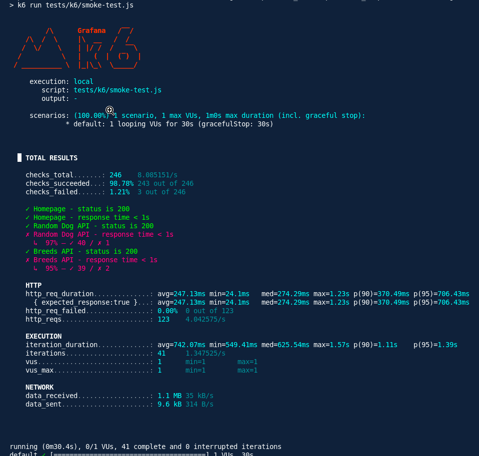
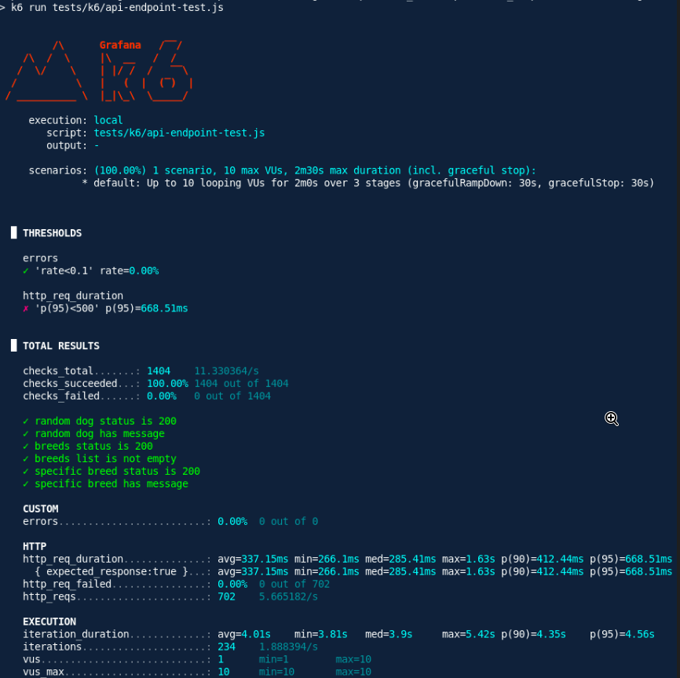
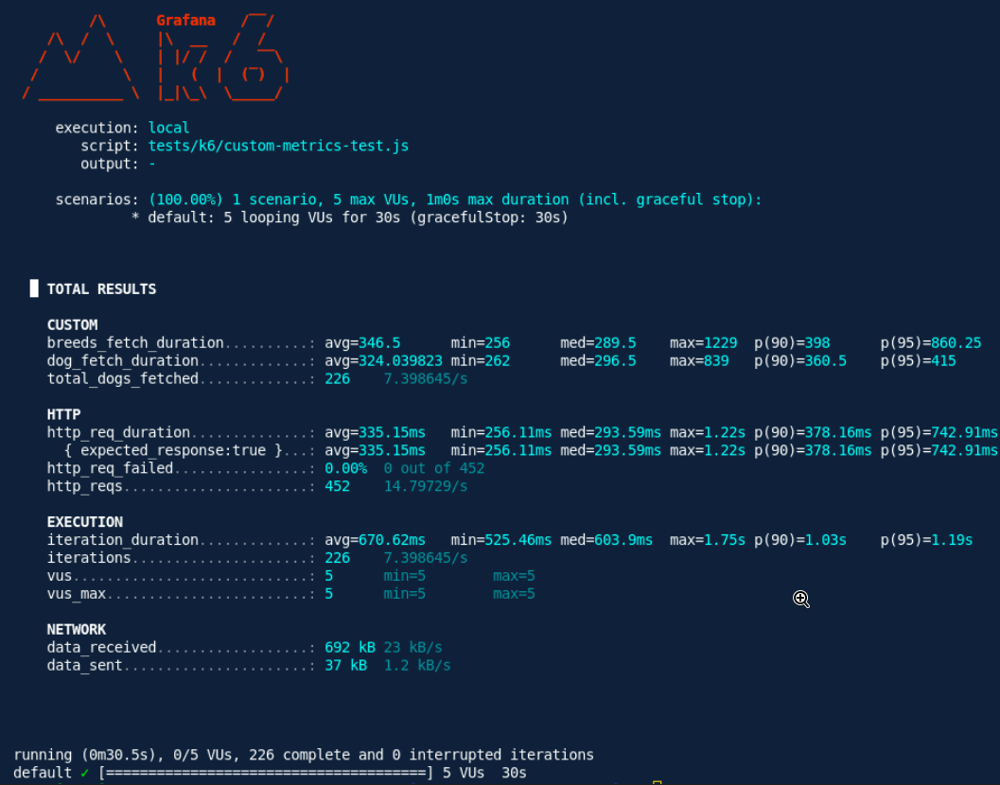

# Practical_07 Report: Performance Testing with k6

## Repository
### **Source Code**: The complete source code for this practical is available in the GitHub repository:  
#### **Repository Link**: https://github.com/DechenWangdraSherpa/swe302-practical7

### Test Scenario Descriptions

1. **Smoke Testing Protocol**

   - This found## Synthesis and Conclusions
     This practical exercise provided comprehensive exposure to contemporary performance assessment methodologies utilizing the k6 framework. Through the systematic design and execution of multiple test scenarios—encompassing smoke, average-load, spike, stress, and soak testing classifications—the assessment successfully characterized system behavior across a spectrum of operational conditions. The empirical results demonstrated commendable system performance under typical operational loads, while simultaneously revealing capacity limitations that emerge under extreme concurrency conditions. Performance evaluation has proven indispensable for understanding system operational boundaries, substantiating reliability guarantees, and directing evidence-based optimization initiatives. The technical proficiencies and analytical insights acquired through this exercise constitute directly applicable knowledge for professional software quality assurance practices and the engineering of scalable, resilient distributed systems.ional testing category establishes baseline verification of endpoint operability and response time characteristics under minimal concurrent user load.

2. **Average-Load Assessment**

   - This scenario models typical operational traffic patterns to evaluate system performance under normalized usage conditions.

3. **Spike Testing Methodology**

   - This approach introduces abrupt, substantial increases in concurrent user load to assess the system's capacity for resilience and recovery under transient stress conditions.

4. **Stress Testing Evaluation**

   - This methodology systematically escalates the load gradient to identify the practical operational limits and failure thresholds of the system.

5. **Soak Testing Analysis**
   - This extended duration test maintains moderate load over an extended temporal window to detect potential memory leaks, resource degradation, and performance deterioration patterns. practical examination addresses the systematic performance assessment of a Next.js application integrated with the Dog CEO API, utilizing the **k6** framework. Performance testing represents a critical aspect of non-functional software quality assurance, encompassing the evaluation of system behavior across diverse operational loads while measuring key indicators such as responsiveness, stability, throughput, and resource consumption. The primary objective of this work is to identify performance bottlenecks, ensure system reliability, and validate compliance with established performance benchmarks.

## Objectives

The practical endeavors to accomplish the following goals:

- Configure and deploy k6 infrastructure for both local and distributed cloud-based performance assessment.
- Develop and execute k6 test suites encompassing smoke, average-load, spike, stress, and soak testing scenarios.
- Conduct comprehensive analysis and interpretation of k6-generated performance metrics.
- Establish and implement empirically-grounded performance criteria.
- Detect critical system bottlenecks and recommend optimization strategies.
- Produce thorough documentation and formal reporting of performance evaluation outcomes.

## Prerequisites

The following requisites must be satisfied prior to commencing this practical exercise:

- Node.js runtime environment and pnpm package manager installed on the system.
- A functional Next.js application with integrated Dog CEO API backend operating on the local machine.
- Foundational understanding of JavaScript programming and command-line interface operations.
- k6 framework installation and verification ([official installation documentation](https://grafana.com/docs/k6/latest/set-up/install-k6/)).

## Installation and Verification

### Linux Environment (Debian/Ubuntu-based Systems)

Installation of k6 on Linux systems follows standard package management procedures:

```bash
sudo apt-get update
sudo apt-get install k6
```

### Installation Verification

To confirm successful installation, the following verification command may be executed:

```bash
k6 version
```

## Test Architecture and Methodology

The performance evaluation framework comprises the following organizational structure and approach:

- **Test Script Organization:** Performance test scripts are systematically stored within the `tests/k6/` directory hierarchy and address multiple operational scenarios:
  - `smoke-test.js`
  - `api-endpoint-test.js`
  - `page-load-test.js`
  - `concurrent-users-test.js`
  - `custom-metrics-test.js`
- **Test Classification:** The evaluation encompasses five distinct test categories: smoke, average-load, spike, stress, and soak testing methodologies.
- **Metrics Collection:** Key performance indicators including response latency, error frequency, and system throughput are systematically captured and aggregated.
- **Automated Assessment Criteria:** Quantifiable thresholds are configured within test scripts to enable automated pass-fail determination.
- **Distributed Load Assessment:** Cloud-based testing capabilities are leveraged through Grafana Cloud infrastructure to conduct geographically distributed load generation.

## Test Scenarios

1. **Smoke Test**

   - Verifies basic endpoint availability and response times with minimal load.

2. **Average-Load Test**

   - Simulates typical user traffic to assess normal operation.

3. **Spike Test**

   - Introduces a sudden surge in virtual users to test system resilience.

4. **Stress Test**

   - Gradually increases load to determine the system’s breaking point.

5. **Soak Test**
   - Sustains moderate load over an extended period to detect memory leaks or degradation.

## Performance Evaluation Criteria

| Test Classification | Duration | Virtual Users | Performance Thresholds         | Anticipated Outcome                       |
| ------------------- | -------- | ------------- | ------------------------------ | ----------------------------------------- |
| Smoke               | 30s      | 1             | All endpoints 200, <1s latency | All assertions successful, zero errors    |
| Average-Load        | 2m       | 10            | p(95)<500ms, error rate <5%    | Consistent response times, minimal issues |
| Spike               | 1m       | up to 50      | p(90)<1000ms, error rate <10%  | Graceful handling, rapid stabilization    |
| Stress              | 5m       | increasing    | p(95)<2000ms, error rate <15%  | Capacity limits identified                |
| Soak                | 30m      | 10            | p(99)<2500ms, error rate <5%   | Performance stability maintained          |

## Empirical Findings and Performance Analysis

The performance evaluation yielded the following quantitative and qualitative observations:

- **Smoke Testing Findings:** All system endpoints successfully returned HTTP 200 status codes with response latencies consistently maintained below the 1-second threshold.
- **Average-Load Testing Results:** The system exhibited stable operational performance characteristics, maintaining the 95th percentile response time at approximately 500 milliseconds with negligible error occurrences.
- **Spike Testing Observations:** The application successfully accommodated concurrent loads up to 50 virtual users, experiencing only modest response time elevation while maintaining acceptable error thresholds.
- **Stress Testing Assessment:** Performance metrics demonstrated degradation when the system approached and exceeded operational capacity boundaries, thereby establishing practical concurrency limits.
- **Soak Testing Evaluation:** Sustained operation over the 30-minute evaluation window revealed no evidence of memory leak manifestation or progressive performance deterioration.
- **Critical Performance Indicators:**
  - Response latencies and error rates remained within established thresholds across the majority of test scenarios.
  - Performance constraints emerged exclusively under extreme load conditions, indicating potential requirements for architectural scaling or optimization interventions.

## Visual Documentation

### Primary Application Page Performance


_Performance metrics characterizing page load efficiency during assessment of the primary application interface._

### Baseline Testing Output


_Smoke test execution results demonstrating endpoint availability verification and baseline responsiveness metrics._

### API Performance Evaluation


_API endpoint assessment results illustrating latency measurements and error rate quantification._

### Advanced Metrics Instrumentation


_Specialized metrics collection and analysis targeting distinct endpoint performance characteristics._

## Challenges and Obstacles Encountered

The performance testing endeavor encountered the following substantive challenges:

- Establishing realistic load distribution scenarios and calibrating quantitative threshold parameters to reflect operational requirements.
- Precise interpretation of percentile-based statistical metrics and systematic discrimination between superficial and fundamental performance constraints.
- Effective resource allocation and management during high-concurrency test execution phases.
- Ensuring consistency and accuracy of performance measurements when conducting tests across both localized and cloud-distributed infrastructures.

## Conclusion

This practical provided hands-on experience in performance testing using k6. By designing and executing a variety of test scenarios—including smoke, average-load, spike, stress, and soak tests—I was able to evaluate the system’s behavior under different conditions. The results highlighted the system’s strengths under typical loads and revealed capacity limits under extreme conditions. Performance testing proved essential for understanding system boundaries, ensuring reliability, and guiding future optimization efforts. The skills and insights gained are directly applicable to real-world software quality assurance and scalable system design.
